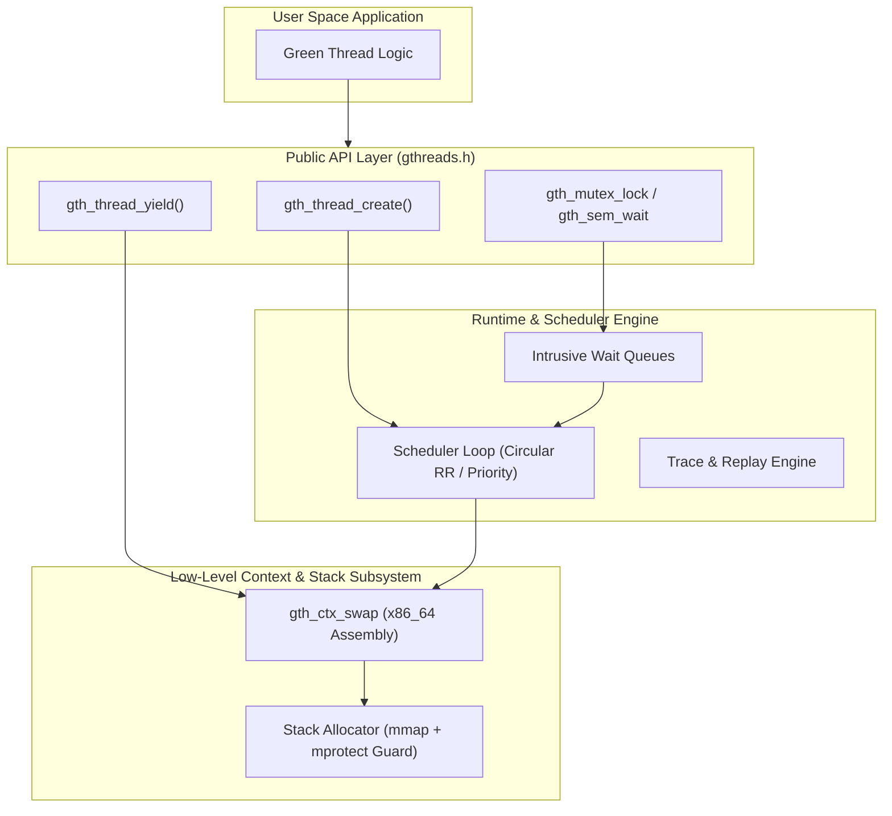

# gthreads

[](https://github.com/k5602/gthreads/actions/workflows/ci.yml)


A deterministic user-space threading runtime in C17 & x86_64 assembly for Linux.


## Why I Built This

After building Vulnera and winning Huawei Spark Infinity, I wanted to go back deeper into systems engineering, Linux OS internals, and low-level concurrency primitives.

This has been my longest project to MVP working from February to July learning and building every layer from scratch: x86-64 assembly context switching, stack guard management, custom schedulers, and synchronization queues.

My planned next step is to build custom concurrency primitives on top of this runtime.

If you have any guidance, notes, ideas, or feedback, it would be greatly appreciated as this is a work in progress and it's educational project.

---

## Architecture



---

## Technical Highlights

- **Zero Dependencies & Assembly Context Switch**: Hand-written x86-64 assembly (`src/context/ctx_x86_64.S`) preserving System V AMD64 ABI callee-saved registers. Embedded `_Alignas(16)` 512-byte FPU buffer in `gth_ctx_t` eliminates dynamic heap allocations and FPU state leaks. Thread stacks allocated via `mmap` with `mprotect` guard pages.
- **Deterministic Replay & Fuzzing**: Binary event recorder (`GTR2` format) and replay engine to reproduce concurrency bugs. Integrated xorshift128+ PRNG for schedule fuzzing with SplitMix64 seed determinism.
- **Fair Schedulers & Sync Primitives**: Circular Round-Robin (starvation-free) and Priority schedulers. Lost-wakeup immune mutexes, counting semaphores, and condition variables with bounded wait queues.
- **Empirical Performance**: Verified 100% clean under AddressSanitizer and UndefinedBehaviorSanitizer.

| Operation | Latency / Throughput |
|---|---|
| **Context switch (yield)** | ~330 ns |
| **Thread create + join** | ~6.0 µs |
| **Mutex lock + unlock** | ~160 ns |
| **Semaphore wait + post** | ~210 ns (~4,600,000 ops/sec) |

---

## Quick Start

```c
#include <stdio.h>
#include <gthreads/gthreads.h>

static void *worker(void *arg) {
    printf("Running on green thread %lu\n", (unsigned long)gth_thread_self());
    return arg;
}

int main(void) {
    gth_runtime_init(&(gth_runtime_config_t){
        .stack_size_bytes = 65536,
        .policy = GTH_SCHED_RR,
        .quantum_us = 1000
    });

    gth_tid_t tid;
    gth_thread_create(&tid, NULL, worker, NULL);
    gth_thread_join(tid, NULL);
    gth_runtime_shutdown();
    return 0;
}
```

---

## Build & Test

```bash
cmake -S . -B build -DCMAKE_BUILD_TYPE=Debug
cmake --build build
ctest --test-dir build --output-on-failure
```
Requires: Linux x86_64, CMake >= 3.20, GCC/Clang (C17), `libcmocka-dev`.

---

## Documentation

- [Architecture Design](docs/architecture/ARCHITECTURE.md) - Deep dive into stack allocation, context switching flow, ABI alignment, and internal state.
- [TDD Matrix](docs/testing/TDD-MATRIX.md) - Test coverage matrix across lifecycle, scheduler, and sync primitives.
